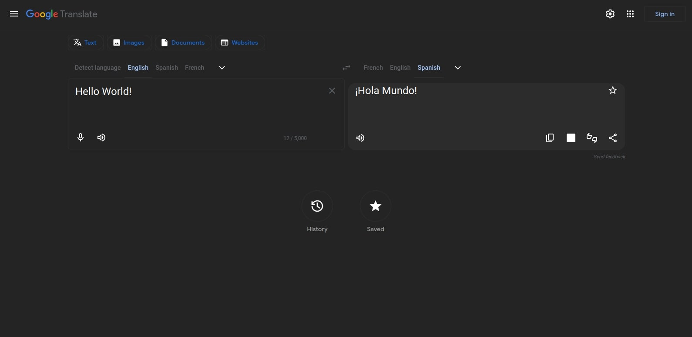

# Dark Mode for Google Translate™ — Firefox

Perfect #242424 dark theme – zero white flash, pro hover lift, fully 2025-proof.

## Preview

## Install
→ [Firefox Add-ons](https://addons.mozilla.org/firefox/addon/dark-mode-for-google-translate/)

## Features
- Exact #242424 background you love
- Zero white flash (preload.css)
- Works on all dynamic Google injections (tiny MutationObserver)
- Beautiful hover lift on buttons
- Clean, readable language dropdowns
- Open-source & contributor-friendly

Made with ❤️ by [charafdotdev](https://charaf.dev)
